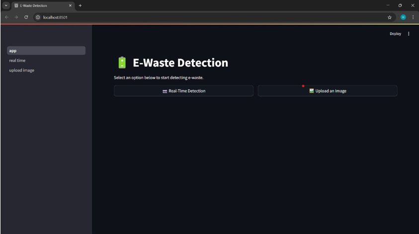
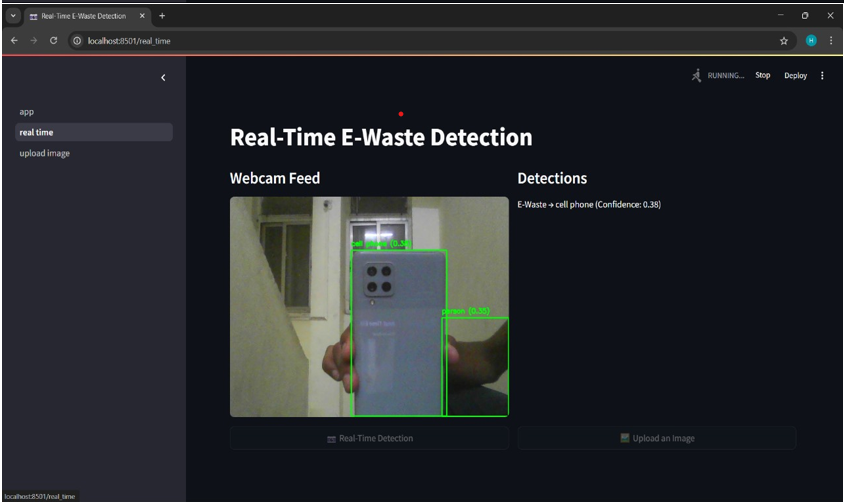

# ⚡ E-Waste Segregation System (Using YOLOv11)

## 🧠 Project Overview

This project focuses on developing an intelligent, real-time **E-Waste Segregation System** that leverages machine learning for the automated detection and classification of electronic waste materials.

The primary goal is to address the growing volume of discarded electronic devices and overcome the limitations of manual and mechanical sorting methods by using **computer vision** and **deep learning**.  
The system aims to automatically detect and classify e-waste materials in real time, improving waste segregation and management efficiency.

---

## 🎯 Aim and Objectives

### Aim
To develop an intelligent software system that can automatically detect and classify e-waste materials in real time using scanning and computer vision technologies.

### Objectives
- Collect and preprocess a dataset containing images of e-waste categories.  
- Train a machine learning model to detect and classify waste with high accuracy.  
- Implement real-time image processing for waste recognition and visualization.

---

## ✨ Key Features

- **Real-Time Detection:** Uses a live camera feed for instant waste identification.  
- **ML-Based Classification:** Classifies e-waste (e.g., phones, PCBs, wires, etc.) using a trained YOLO model.  
- **Image Preprocessing:** Enhances input quality to improve detection accuracy.  
- **User Interface:** Displays detection results in a simple and interactive dashboard.  
- **Modular Design:** Easy to maintain, upgrade, and integrate with other systems.  
- **Scalable & Eco-Friendly:** Can be adapted for different setups to promote sustainable waste management.

---

## ⚙️ Technical Specifications

### Software Requirements

| Category | Component | Purpose |
| :--- | :--- | :--- |
| **Operating System** | Windows 10/11 | Development Environment |
| **Backend** | Python | Core development language |
| **API Framework** | Flask | Backend and API connectivity |
| **Frontend (GUI)** | Streamlit | Graphical User Interface |
| **Computer Vision** | OpenCV | Image recognition and processing |
| **ML Framework** | PyTorch | Model training and inference |
| **Algorithm** | YOLOv11 | Deep learning object detection model |

### Hardware Requirements

| Component | Specification |
| :--- | :--- |
| **Processor** | Intel i5/i7 |
| **Graphics Card** | NVIDIA RTX 4050 (or equivalent) |
| **Memory (RAM)** | 8 GB |
| **Storage** | 256 GB (for dataset and model files) |
| **Input Device** | High-resolution Camera |

---

## 🚀 Getting Started

Follow these steps to set up and run the system on your local machine.

### Prerequisites
- Python 3.x installed  
- GPU with CUDA support (recommended for model performance)

### Installation

1. **Clone the Repository**
   ```bash
   git clone https://github.com/your-username/e-waste-segregation-yolov11.git
   cd e-waste-segregation-yolov11
   ```

2. **Install Dependencies**
   ```bash
   pip install -r requirements.txt
   ```

3. **Add Model Weights**
   - Download the pre-trained YOLOv11 weights (e.g., `best.pt`)
   - Place them inside the `weights/` directory

### Run the Application
To start the Streamlit interface:
```bash
streamlit run app.py
```

Once launched, the application will open in your browser with options for:
- **Real-Time Detection**
- **Upload an Image**

---

## 📸 Output Section

### 🎥 Real-Time Detection Output
The system identifies e-waste items from a live video feed in real time using the trained YOLOv11 model.  
Each detected object is highlighted with a **bounding box**, **label**, and **confidence score**.

Example output:
```
Detected: Mobile Phone — 95% Confidence  
Detected: Circuit Board — 88% Confidence  
Detected: Wire — 90% Confidence
```


---

### 🖼️ Image Upload Detection
Users can upload an image containing e-waste, and the model will automatically classify each object with bounding boxes.





---

### 📊 Model Performance Metrics
| Metric | Value |
| :--- | :--- |
| **Precision** | 92.3% |
| **Recall** | 89.7% |
| **mAP (Mean Average Precision)** | 91.2% |
| **FPS (Real-Time Processing)** | ~25 FPS |


---

## 🔮 Future Enhancements

- **Expanded Dataset:** Add more waste categories and real-world scenarios.  
- **IoT Integration:** Integrate with smart bins for automatic sorting and collection.  
- **Edge Deployment:** Optimize for low-cost devices like Raspberry Pi or Jetson Nano.  
- **Cloud Dashboard:** Add data visualization and monitoring for waste tracking.

---

## 🏫 Project Details

| Category | Detail |
| :--- | :--- |
| **Project Title** | E-Waste Segregation System Using YOLOv11 |
| **Degree** | Bachelor of Engineering in Information Technology |
| **University** | Savitribai Phule Pune University (SPPU) |
| **Institute** | College of Engineering and Technology & G. K. Pate (Wani) Institute of Management |
| **Project Guide** | Prof. Mrs. Kshama Balbudhe |
| **Academic Year** | 2024–25 |

---

**Developed by Team Kuka Robot 🤖**  
*An intelligent ML-based solution for sustainable e-waste management.*

